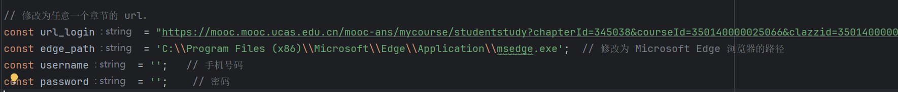
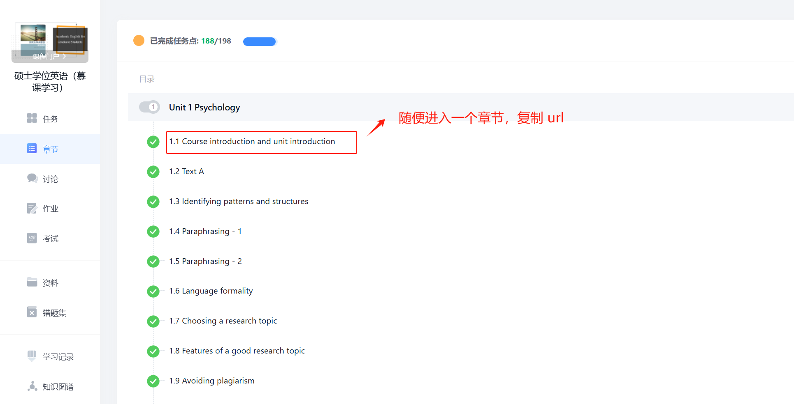
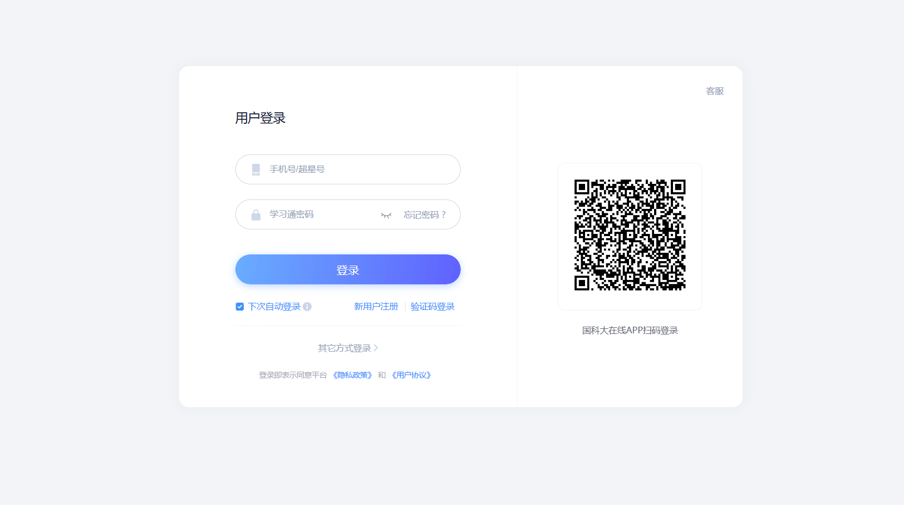
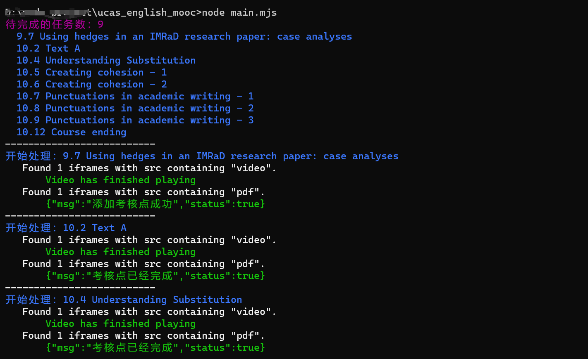

# 前言

慕课的前端 ui 好像每年都会变，当前脚本只测试于 2024 秋季慕课。(2024.11.16)

quiz 得自己做，该项目只帮助处理  视频任务点 和 pdf 任务点 。


# 使用

## 1、环境准备

1、安装 node 

2、安装 pnpm (可选，但是建议用 pnpm )

3、下载项目

```
git clone https://github.com/kejaly/ucas_english_mooc.git
cd ucas_english_mooc
```

4、安装 package

```cmd
pnpm install 

# 没安装 pnpm 的话，直接 npm install
```


## 2、修改 main.mjs 中如下四个参数信息：



### 获取 url_login 

1、访问国科大在线： https://mooc.ucas.edu.cn/portal

2、校内登录 -> 信息门户登录。

3、登录之后回到 https://mooc.ucas.edu.cn/portal  -> 进入个人空间 -> 选择 "硕士学位英语（慕课学习）" -> 点击章节-> 随便进入一个章节，复制 url （就是  url_login 参数）



### 获取 username 和 password

在浏览器无痕模式下访问上面获取的 url ，会重定向到：

https://passport.mooc.ucas.edu.cn/login



username 和 paaword 就是这里的手机号和密码。 

### 获取 edge_path

edge_path 正常来说都是 `C:\Program Files (x86)\Microsoft\Edge\Application\msedge.exe`，不需要修改。


## 3、执行

```
node main.mjs
```


# 技术实现

基于 playwright 自动化框架。 

- 处理 video 是用 playwright 来播放视频。
- 处理 pdf 是直接发包。

# Windows 禁止电脑休眠

方便想实现一觉醒来发现课全刷完的 ucaser : 

https://www.bilibili.com/video/BV1xS4y1K7nQ

# 运行的截图：


